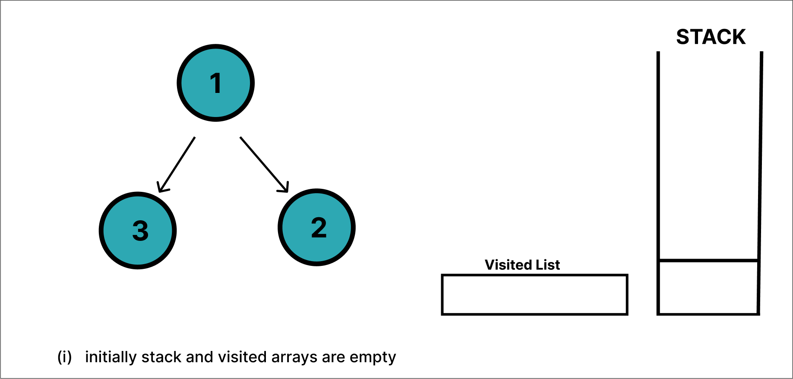
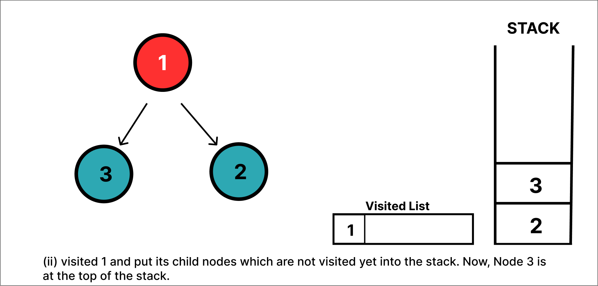
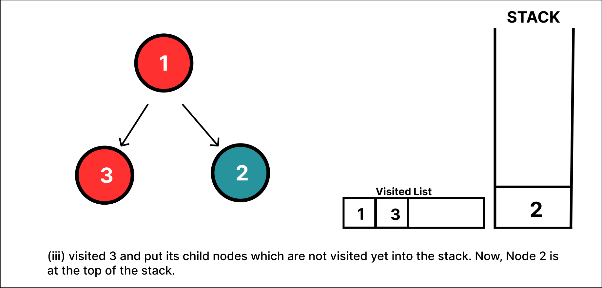
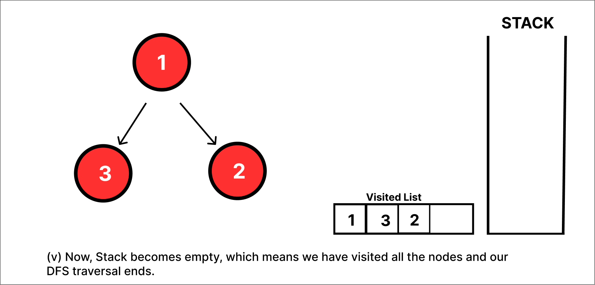

# Depth-First Search Algorithm
### Depth first Search or Depth first traversal is a recursive algorithm for searching all the vertices of a graph or tree data structure. 
The depth-first search or DFS algorithm traverses or explores data structures, such as trees and graphs. The algorithm starts at the root node (in the case of a graph, you can use any random node as the root node) and examines each branch as far as possible before backtracking.

To implement DFS traversal, you need to utilize a stack data structure with a maximum size equal to the total number of vertices in the graph.

The DFS algorithm works as follows:

Step 1: <i>Start by putting any one of the graph's vertices on top of a stack.</i>

Step 2: <i>Take the top item of the stack and add it to the visited list.</i>

Step 3 : <i>Create a list of that vertex's adjacent nodes. Add the ones which aren't in the visited list to the top of the stack.</i>

Step 4:<i> Keep repeating steps 2 and 3 until the stack is empty</i>.

## Application of DFS Algorithm
<ol>
<li>
For finding the path
<li>
To test if the graph is bipartite
</li>
<li>
For finding the strongly connected components of a graph
</li>
<li>
For detecting cycles in a graph
</li>

## Example for DFS algorithm
Below depicts a traversal example  based on Depth First Search Algorithm

![newnode1]

pushed the first element 

![newnode2]

popped the first element 

![newnode3]

pushed the second element

![newnode4]

pushed the third element

![newnode5]

popped the third element 

![newnode6]

popped the second element 